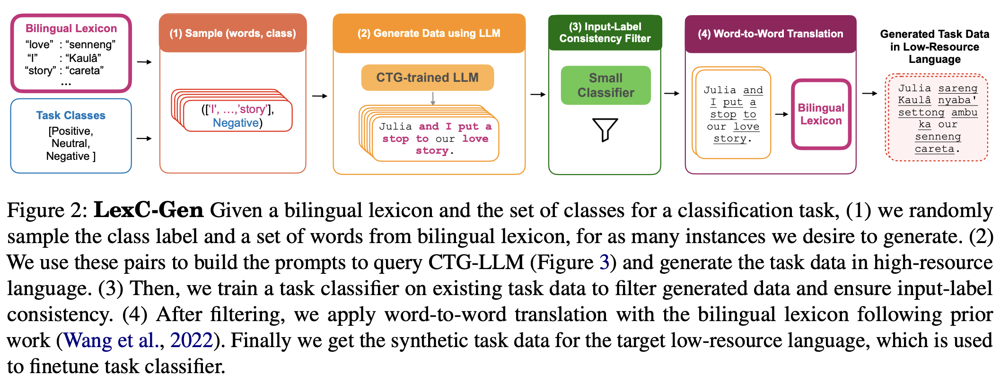

# LexC-Gen Generated Data Repository

📄 Paper: TODO

💻 Code: https://github.com/BatsResearch/LexC-Gen 

## HuggingFace 🤗 

You can find our final generated datasets on HuggingFace:
- [NusaX-senti-LexC-Gen](https://huggingface.co/datasets/BatsResearch/NusaX-senti-LexC-Gen)
- [sib200-LexC-Gen](https://huggingface.co/datasets/BatsResearch/sib200-LexC-Gen)

---

## Repo Description

This repository stores all the intermediate and final data artifacts of LexC-Gen for both [NusaX](https://aclanthology.org/2023.eacl-main.57/) and [SIB-200](https://arxiv.org/abs/2309.07445) tasks. The data artifacts include:
- raw generated English texts data after step (2) (`.txt` format in `{task}-lexcgen-raw-data/`)
- raw texts converted to csv (`.csv` format in `{task}-lexcgen-processed-data/`)
- filtered data after input-label consistency filtering, which is after step (3) (`filtered-*.csv`)
- tokenized English data with Stanza after filtering (`tokenized_filtered-*.csv`)
- translated to respective low-resource languages using [Gatitos bilingual lexicon](https://aclanthology.org/2023.emnlp-main.26/), which is after step (4) (`translated-*.csv`)

The file string name is in the format of: `{model_name}-{task_type}-en-{lang}-ctg-total{size}`. Here are their descriptions:
- `model_name`: LLM used to generate lexicon-conditioned data
- `task_type`: `sa` for sentiment analysis and `tm` for topic classification (`tm` because originally we call it topic modeling)
- `lang`: low-resource language code
- `size`: 1K, 10K, 100K generated data size, which refers to the size of LexC-Gen generated data *before* filtering.
